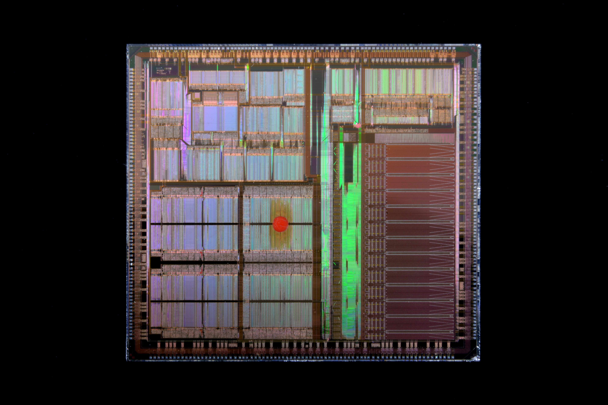
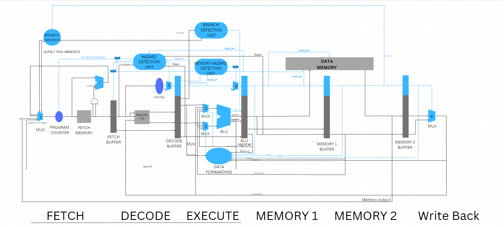

# 6 Stage Processor

## Table of Contents

* [Project Description](#Project-Description)
* [Final Design](#Final-Design)
* [How to use](#How-to-use)
* [References](#References)
* [Contributors](#Contributors)

# Project Description
A Harvard six stages pipedline processor that implements fullforwarding, static branch prediction and interrupt handling.
A Special Compiler for compiling the instruction set commands to machine code.

# Final Design

[Click Here for Higher Resolution Design](https://www.canva.com/design/DAFf1KubZrc/6x8z1np1Zx5c2jGNrf8jeg/edit?utm_content=DAFf1KubZrc&utm_campaign=designshare&utm_medium=link2&utm_source=sharebutton)

# How to use
1. Create a project using modelsim and add all vhdl files.
2. Compile all files.
3. Run compiler.cpp on your desired code.
4. Copy any do file and edit the memory importing command and any intializations.
5. Run your do file and Watch your code in action.

# References
You can find more about the project specifics in the project document and reference textbook.
- [Project Description](ProjectDescription.pdf)
- Computer Organization and Design - Fifth Edition - David A. Patterson & John L. Hennessy

# Contributors
1. [Salah Abotable](https://github.com/SalahAbotaleb)
2. [Moaaz Tarek](https://github.com/moa234)
3. [Hussein Elhawary](https://github.com/Hussein-Elhawary)
4. [Omar Elzahar](https://github.com/omarelzahar02)
